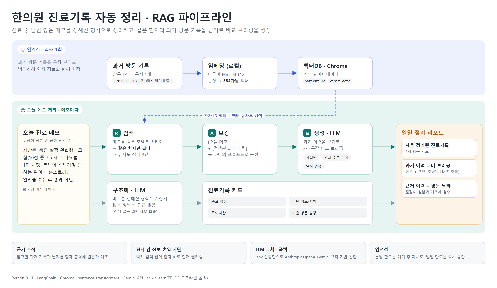
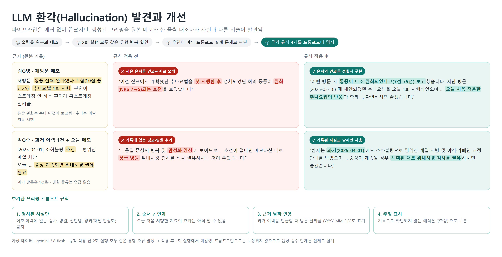

# 한의원 진료 기록 자동 정리 도우미 (RAG 기반)

## 무엇을 해결하려고 만들었나

소규모 한의원에서는 원장이 진료 중에는 짧게 메모만 해두고, 퇴근 후에 그 메모를
정식 진료기록 형태로 다시 정리하고 지난 방문 이력을 직접 뒤적여 비교하는 작업을
매일 반복하는 경우가 많다. 하루 진료가 끝나도 실질적인 "업무"가 집까지 이어지는
셈이다.

이 프로젝트는 그 반복 작업을 자동화한다. 진료 중 남긴 날것의 메모를 입력하면:

1. **구조화** — 증상 / 처방·치료 / 특이사항 / 다음 방문 권장을 정해진 형식으로 자동 정리
2. **이력 검색 (Retrieval)** — 같은 환자의 과거 방문 기록을 벡터DB에서 의미 기반으로 검색
3. **비교 브리핑 생성 (Generation)** — 과거 이력을 근거로 "이번 방문에서 참고할 점"을 자동 요약

을 수행해서, 원장님이 다음 날 아침 정리된 결과만 검토하면 되도록 만들었다.
2번(검색)과 3번(그 검색 결과를 근거로 생성)이 합쳐지면 **RAG(Retrieval-Augmented
Generation)** 구조가 된다 — 과거 이력이라는 지식 베이스를 검색해서, 그 결과를
LLM이 실제로 참고하도록 만드는 것.



## 데이터에 대해

`data/sample_notes.py`의 환자 메모는 전부 **가상의 예시 데이터**다.
실제 환자 정보를 다루려면 반드시 개인정보 비식별화, 의료법상 진료기록
보관·처리 요건, 환자 동의 절차를 먼저 검토해야 한다. 이 프로젝트는
"파이프라인이 실제로 동작하는가"를 검증하는 프로토타입 단계다.

## 구조

```
data/sample_notes.py   - 가상 환자 메모(오늘 메모 + 과거 이력)
local_embeddings.py    - 오프라인(TF-IDF) 폴백 임베딩
vectorstore.py         - 과거 이력을 벡터DB(Chroma)에 적재 / 검색
llm.py                 - LLM 호출 추상화 (Anthropic/OpenAI/Gemini/폴백), 429 재시도
pipeline.py            - 구조화 -> 이력 검색 -> 비교 브리핑 생성 파이프라인
main.py                - 실행 진입점, 오늘자 브리핑을 markdown으로 출력/저장
sample_output/         - 실행 결과 예시 (Gemini 연결 / 폴백 모드)
```

## 실행 방법

> **Python 버전 주의 (Windows)**: `chromadb==0.5.20`이 의존하는 `chroma-hnswlib`는
> Windows용 사전 빌드 휠이 Python 3.11까지만 제공된다. 3.12 이상에서는 C++ 빌드
> 도구(Visual Studio)가 없으면 설치가 실패하므로 Python 3.11 가상환경을 권장한다.

```bash
py -3.11 -m venv .venv
.venv\Scripts\python -m pip install -r requirements.txt

.venv\Scripts\python vectorstore.py   # 최초 1회: 과거 이력을 벡터DB에 적재
.venv\Scripts\python main.py          # 오늘 메모 처리 -> 정리본 출력 (output/*.md)
```

## 실제 LLM 연결하기

API 키가 없으면 파이프라인 구조만 확인할 수 있도록 **폴백(규칙 기반) 모드**로
동작한다. 실제 LLM 답변을 받으려면 `.env.example`을 `.env`로 복사하고 아래 중
하나를 채우면 된다. 여러 개를 채우면 Anthropic -> OpenAI -> Gemini 순으로 사용한다.

```
ANTHROPIC_API_KEY=sk-ant-...
OPENAI_API_KEY=sk-...
GEMINI_API_KEY=...          # Google AI Studio에서 발급, 무료 티어 있음
GEMINI_MODEL=               # 선택, 비우면 gemini-3.8-flash
```

코드 수정은 필요 없다. Gemini는 OpenAI 호환 엔드포인트로 호출하므로 추가 패키지도
필요 없다.

- **무료 티어 한도**: Gemini 무료 티어는 모델당 분당 5회 / 일 20회 수준이라
  `main.py` 1회 실행(메모 4건 기준 LLM 7회 호출)에 분당 한도가 걸린다. `llm.py`가
  안내된 시간만큼 기다렸다 재시도하며, 일일 한도 소진 시에는 즉시 중단하고 안내한다.
- **데이터 사용**: 무료 티어는 입력 내용이 서비스 개선에 사용될 수 있으므로
  **가상 데이터로만** 테스트해야 한다.

## 환각(hallucination) 대응

실제 LLM 연결 후 브리핑에서 "추나 시행 후 통증 완화"처럼 메모의 서술 순서를 인과로
오해하거나, 기록에 없는 "재발성", "상급 병원" 같은 표현을 덧붙이는 오류가 반복
관찰됐다. 그래서 브리핑 프롬프트에 다음 규칙을 명시했다.

1. 오늘 메모와 과거 이력에 명시된 사실만 사용
2. 서술 순서를 인과관계로 해석하지 않음 (오늘 처음 시행한 치료의 효과는 알 수 없음)
3. 과거 이력 인용 시 방문 날짜 표기
4. 기록으로 확인되지 않는 추정은 '(추정)' 표시

규칙 적용 후 위 오류는 사라졌지만(1회 확인), 프롬프트만으로는 보장되지 않으므로
원장 검수 단계가 필수다.



## 임베딩에 대한 참고

`vectorstore.py`는 기본적으로 HuggingFace의 다국어 임베딩 모델
(`paraphrase-multilingual-MiniLM-L12-v2`)을 사용하도록 설계했다. 다만 이
프로젝트를 만든 개발 환경(샌드박스)은 huggingface.co로 나가는 네트워크가
막혀 있어서, 연결이 안 될 경우 자동으로 오프라인 TF-IDF 기반 임베딩
(`local_embeddings.py`)으로 전환되도록 폴백을 구현해뒀다. 인터넷이 열려있는
일반 PC/서버에서는 별도 설정 없이 신경망 임베딩이 정상적으로 쓰인다
(Windows 11 + Python 3.11에서 384차원 벡터 적재 및 의미 기반 검색 동작 확인).

주의: 벡터DB를 신경망 임베딩(384차원)으로 적재한 뒤 실행 시점에 네트워크가 끊겨
TF-IDF 폴백으로 전환되면 벡터 차원이 달라 검색이 실패할 수 있다.

## 다음 단계 (실제로 쓰려면)

- 원장이 승인한 진료기록을 벡터DB에 누적 적재 (현재는 샘플 이력만 적재, 재적재 시 초기화)
- 검색 시 직전 방문 기록 항상 포함 + 이력을 날짜순으로 정렬해 LLM에 전달
- 오늘 메모 없이 과거 이력만으로 만드는 '진료 전 사전 브리핑'

- 실제 진료 메모를 안전하게 입력받는 방법(예: 음성 메모 -> STT -> 텍스트) 연동
- 환자 개인정보 비식별화/암호화, 접근 권한 관리
- 원장님이 매일 보는 화면(간단한 웹 UI)으로 감싸기
- 오탐(잘못된 요약)을 원장님이 바로 고칠 수 있는 검수 기능
